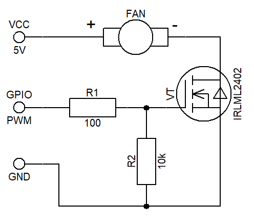
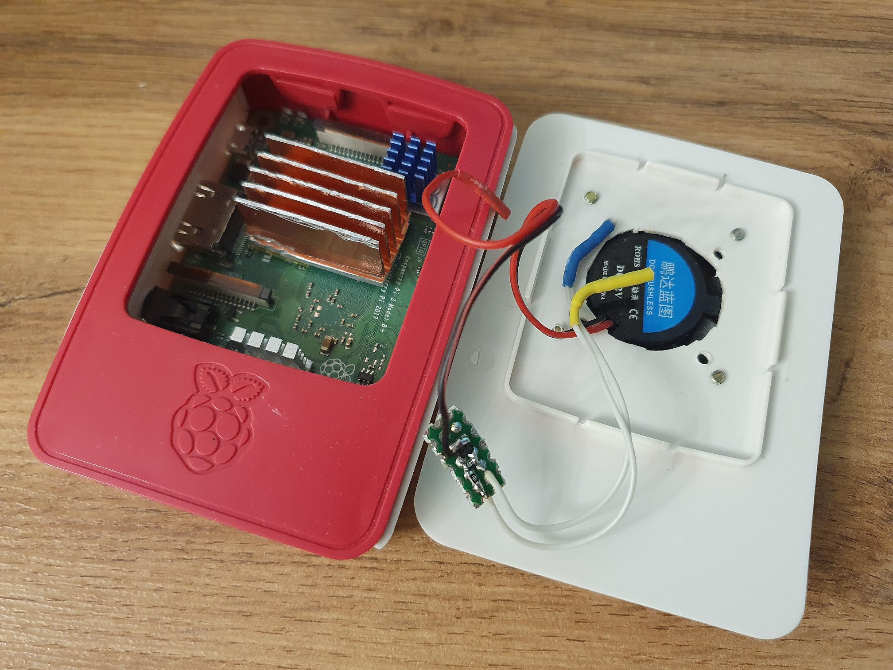

# Raspberry Pi Fan Control

[](https://www.raspberrypi.com/)

[](https://mypy-lang.org/)
[](https://opensource.org/licenses/MIT)

This project provides examples of fan control based on the current CPU temperature.

It includes implementations of a relay controller and a proportional controller. 

The fan is connected via a transistor switch to the 4th pin of the I/O ports. The fan connection pin can be changed in scripts. The remaining parameters can be set at startup.

## 🚀 Quick start

### Prerequisites
Clone repository:
```bash 
git clone https://github.com/Nkeramov/rpi_fan_control.git
```
Switch to repo directory:
```bash 
cd rpi_fan_control
```
### Traditional method with venv and pip
Create and activate virtual environment:
```bash 
python -m venv .venv 
source .venv/bin/activate       # Linux/Mac
# or
./venv/Scripts/activate         # Windows
```
Install dependencies:
```bash
pip install -r requirements.txt
```
Run relay fan controller with command (args for example):
```bash
python3 relay_controller.py --lower 45 --upper 50 --delay 5
```
Run proportional fan controller with command (args for example):
```bash
python3 proportional_controller.py --temp 45 --delay 5 --p 15.0 --dmin 50 --dmax 100
```
### Modern method with uv
Install dependencies and create virtual environment automatically:
```bash
uv sync
```
Run relay fan controller with command (virtual environment is handled automatically, args for example):
```bash
uv run relay_controller.py --lower 45 --upper 50 --delay 5
```
Run proportional fan controller with command (virtual environment is handled automatically, args for example):
```bash
uv run proportional_controller.py --temp 45 --delay 5 --p 15.0 --dmin 50 --dmax 100
```
Or with explicit activation:
```bash
source .venv/bin/activate       # After uv sync
python3 relay_controller.py --lower 45 --upper 50 --delay 5
# or
python3 proportional_controller.py --temp 45 --delay 5 --p 15.0 --dmin 50 --dmax 100
```

Also you can use the launch script `run.sh`, making it executable first
```bash
chmod +x run.sh
```
The script arguments can be changed as desired.

## 🔌 Connection diagram

The connection diagram is shown below. The fan is controlled by a transistor switch based on the IRLML2402 N-channel MOSFET. 

<div align="center">
    
</div>

In my case, I used a 12-volt fan instead of a 5-volt one, because experiments 
showed that the 5-volt fan was noticeably noisy even at minimum speed. The fan cools the radiator down to an acceptable 45 °C pretty quickly. The photo also shows how the fan and transistor switch are connected to the board.

<div align="center">
    
</div>

## ⚙️  Adding to startup

You can set up automatic script launch at system startup.

Open the `/etc/rc.local` file in editor:
```bash
sudo nano /etc/rc.local
```
Add to the end of file this line:
```bash
/home/pi/raspberry_pi_fan_control/run.sh &
```
Press Ctrl+O → Enter → Ctrl+X to save and exit.
With these few easy steps, you now have automatic fan control.

## 🤝 Contributing

If you want to contribute, please follow these steps:

1. Fork the repository.
2. Create a new branch for your feature or bug fix.
3. Make your changes and commit them.
4. Push to your fork and create a pull request.

## 📝 License

This project is licensed under the MIT License. See the [LICENSE](LICENSE) file for details.

## 📚 References 

- [Getting started](https://www.raspberrypi.com/documentation/computers/getting-started.html)
- [Raspberry Pi OS](https://www.raspberrypi.com/documentation/computers/os.html)
